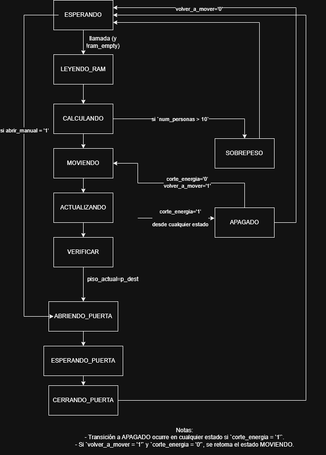

# Proyecto VHDL - Sistema de Control de Ascensor

Este repositorio contiene la implementación completa de un sistema de control de ascensor digital utilizando VHDL, orientado a plataformas FPGA como la DE0 con Cyclone III. El diseño incluye control de movimiento entre 5 pisos, detección de sobrepeso, manejo de corte de energía, cola de llamadas mediante memoria RAM y control PWM para motores del ascensor y puerta.

---

## 📐 Arquitectura general

El sistema se compone de los siguientes módulos:

- `top_ascensor.vhd`: **Módulo principal** que integra toda la lógica FSM, los componentes, y el control del ascensor.
- `motor_ascensor.vhd`: Genera señal PWM para el motor de elevación.
- `motor_puerta.vhd`: Controla el motor de apertura/cierre de puertas mediante PWM.
- `ram_llamadas.vhd`: RAM FIFO para gestionar llamadas pendientes a pisos.
- `display_7seg_piso.vhd`: Muestra el piso actual en dos displays de 7 segmentos (letra “P” y número).
- `top_test.vhd`: Banco de pruebas básico.

---

## 🔄 Diagrama de estados

La lógica del sistema está gobernada por una máquina de estados finita (FSM), cuya transición está basada en eventos como llamadas de piso, sobrepeso, corte de energía, y sincronización de tiempos de puerta y movimiento.

### 🎯 Diagrama de Estados



---

## ⚙️ Funcionalidades

- ✅ Movimiento ascendente y descendente entre 5 pisos.
- ✅ Cola de llamadas con prioridad FIFO mediante RAM.
- ✅ Control PWM para motores (motor principal y servo de puerta).
- ✅ Visualización de piso actual en displays de 7 segmentos.
- ✅ Lógica de sobrepeso y prevención de movimiento con más de 10 personas.
- ✅ Detección de flancos para pulsadores.
- ✅ Modo `APAGADO` al detectar `corte_energia`, con reanudación automática.
- ✅ Sonido y luces de alerta (buzzer y LED).

---

## 🚀 Cómo usar este proyecto

### 🧰 Requisitos

- Intel Quartus II (13.1 recomendado)
- FPGA DE0 Cyclone III (u otra compatible)
- Cables y displays de 7 segmentos
- Pulsadores externos y switches para simular llamadas y personas

### 🛠️ Pasos

1. Clona el repositorio:

```
git clone https://github.com/JuanFerMartinez/VHDL-ELEVATOR.git
```

2. Abre el proyecto en Quartus.  
3. Asigna los pines correspondientes en el Pin Planner.  
4. Compila y sube a la FPGA.  
5. Prueba con botones físicos o simulación.

---

## 📂 Estructura del proyecto

```
VHDL-ELEVATOR/
│
├── top_ascensor.vhd                    # Módulo principal (FSM)
├── motor_ascensor.vhd                  # PWM para motor principal
├── motor_puerta.vhd                    # PWM para motor de puerta
├── ram_llamadas.vhd                    # RAM FIFO para llamadas
├── display_7seg_piso.vhd               # Visualización de piso actual
├── tb_top_ascensor.vhd                 # Banco de pruebas
├── DiagramaDeEstadosAscensor.drawio.png  # Imagen FSM
└── └─contador_personas.vhd             # Modulo contador de personas con IR (no implementado)
└── README.md                           # Este archivo
```

---

## 👤 Autor

**Juan Fernando Martínez Ruiz**  
Estudiante de Ingeniería Electrónica y Telecomunicaciones  
Universidad del Cauca  
🔗 [LinkedIn](https://www.linkedin.com/in/juanfermartinez/)

---

## 📜 Derechos

Todos los derechos reservados.  
© 2025 Juan Fernando Martínez Ruiz  
